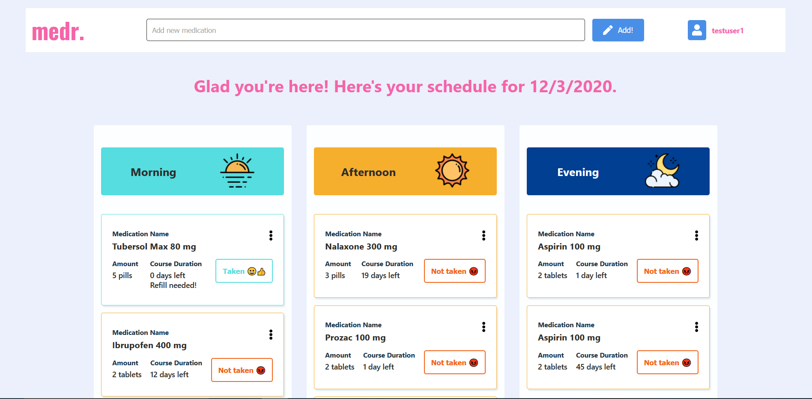

<!--!TODO: README needs edits-->

  
  &nbsp;&nbsp;
  &nbsp;&nbsp;
    &nbsp;&nbsp;
    &nbsp;&nbsp;

# MEDR

## Description

Ever forgot to take your medications? Ever wanted to have one place to keep track of all of them? MEDR is a full stack web app allowing to store and track prescriptions to help with medicine compliance and health. Coming Soon.

### Getting Started/Requirements/Prerequisites/Dependencies

Include any essential instructions for:

- Getting it
- Installing It
- Configuring It
- Running it

### Contributing

- Contributor Guidelines
- Code Style/Requirements
- Format for commit messages
- Thank you (name contributors)

## Tech

### Frontend

- React

### Backend

- Node
- Express
- PostgreSQL
- MongoDB (Development/Testing)
- Mongoose (Development/Testing)

## TODO

- [x] Swap out MongoDB for PostgreSQL
- [ ] Can add medication
- [ ] Can delete medication
- [x] App lists medication
- [ ] Add session tokens
- [ ] Figure out if privacy policy need
- [x] Get modals for medication add and edit
- [ ] Make the app work Offline
- [ ] Deploy on Heroku/Netlify

### License

MIT
