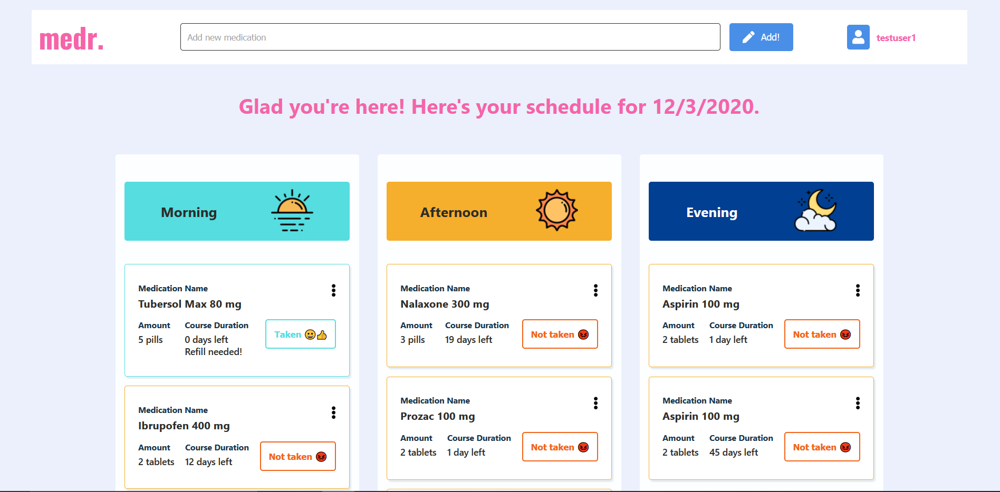
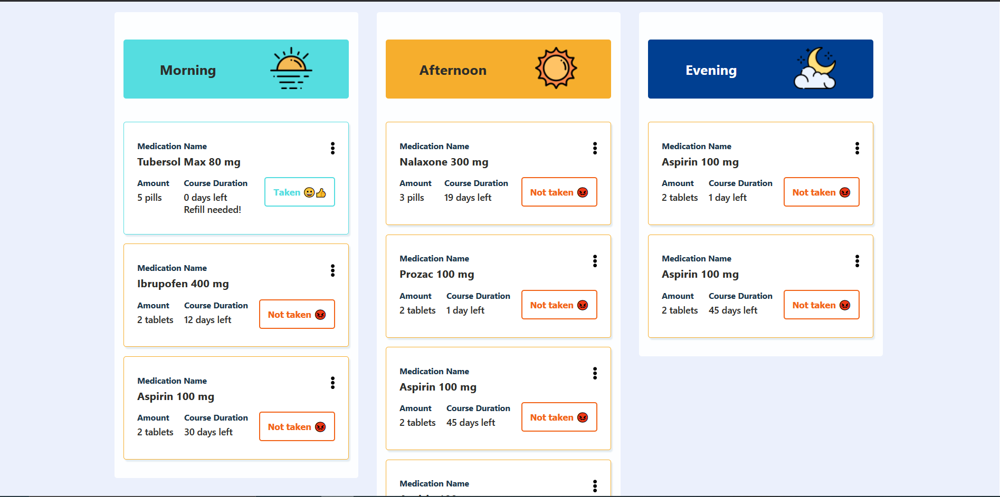

# MEDR

## Description

Ever forgot to take your medications? Ever wanted to have one place to keep track of all of them? MEDR is a full stack web app allowing to store and track prescriptions to help with medicine compliance and health. Coming Soon.

## Tech

### Frontend

- React

### Backend

- Node
- Express
- MongoDB (Development/Testing)
- Mongoose (Development/Testing)
- PostgreSQL
- Prisma
- Amazon AWS

## Todo

---

- [ ] Swap out MongoDB for PostgresSQL/MariaDB
- [ ] Setup/test cloud database connection
- [ ] Get modals for medication add
